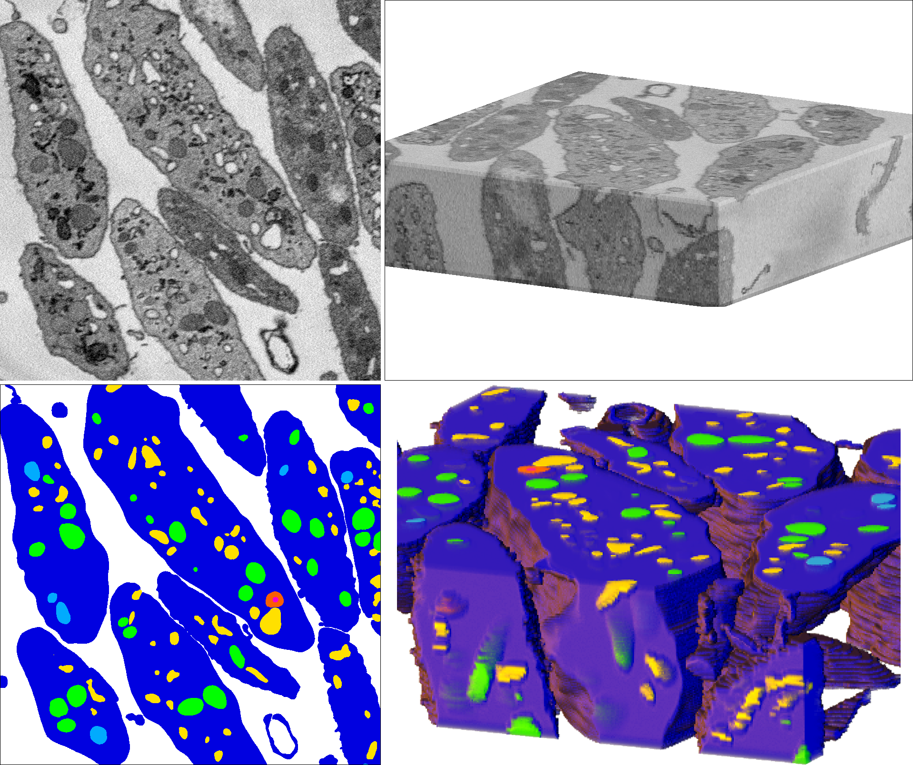

# bio3d-vision.github.io
Segmentation datasets from 3D biological microscopy, organized by [LCIMB](about-lcimb/)

## Platelet

From [LCIMB](about-lcimb/), in collaboration with the [Storrie lab](https://physiology.uams.edu/faculty/brian-storrie/).

**TODO**: Adapt a detailed description of the dataset, the segmentation task, and performance metrics from the statement of work document.

**Download**: Coming soon!

---