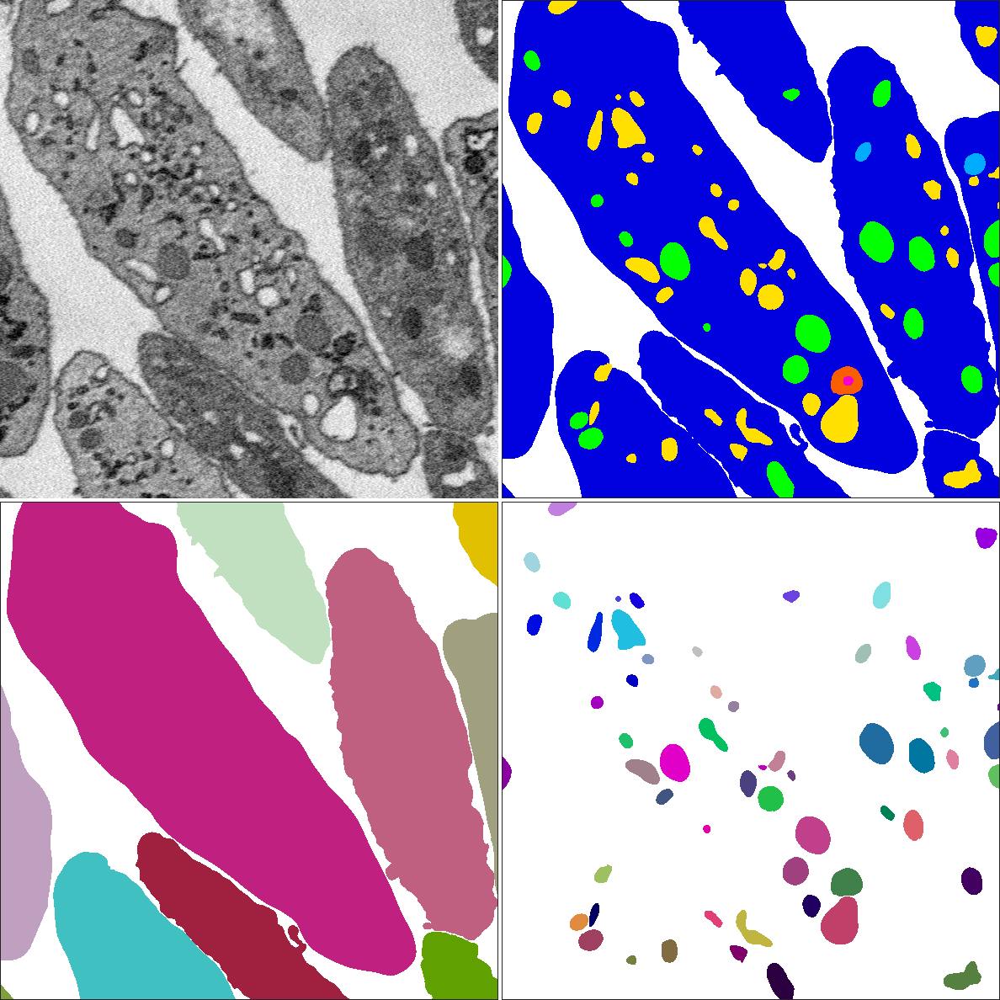

Segmentation datasets from 3D biological microscopy. Organized by [LCIMB](about-lcimb/), a part of [NIH/NIBIB](https://www.nibib.nih.gov/).

---

# platelet-em

### Download

All image and label files can be downloaded together, or they can be downloaded separately.

#### All

[Download images and labels](https://www.dropbox.com/s/lo6i7v2mc9z2wft/images-and-labels.zip?dl=1) (95.8 MB)

---

#### Images only

[Download images](https://www.dropbox.com/s/u592kqjbjpvhq8n/images.zip?dl=0) (90.9 MB)

#### Labels only

[Download semantic labels](https://www.dropbox.com/s/p4iugak20g8uccd/labels-semantic.zip?dl=1) (2.1 MB)

[Download instance labels](https://www.dropbox.com/s/s1asybvd3vauhiy/labels-instance.zip?dl=1) (2.6 MB)

---

### Description

[Click here](platelet-description.html) for a detailed description of the **platelet-em** dataset.