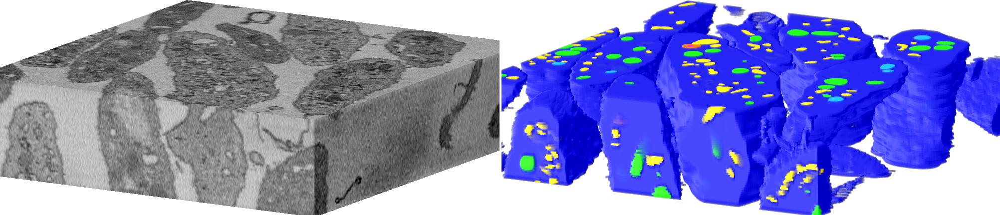

The **bio3d-vision** dataset collection's goal is to aggregate high-quality, large-scale 3D biological microscopy datasets whose analyses present challenging computer vision problems that are important to advancing the state of microscopy.

The **bio3d-vision** project is organized by [LCIMB](about-lcimb/), a part of [NIH/NIBIB](https://www.nibib.nih.gov/).

---

# Getting started

---

In addition to manual dataset downloads below, this project provides a `bio3d_vision` python package to simplify downloading and manipulating 3D microscopy images and labels. 

### Requirements

The `bio3d_vision` package uses Python 3.6+ features, and requires `matplotlib`, `numpy`, `scipy`, and `tifffile`.

### Clone the repo

Clone the `bio3d_vision` package from [https://github.com/bio3d-vision/bio3d_vision](https://github.com/bio3d-vision/bio3d_vision). Add it to your system path or a project folder to use it. TODO: pip integration.

### Example: *platelet-em*

[Click here for an example](examples/example_data_prep.html) of using `bio3d_vision` to download the *platelet-em* dataset and load it into numpy for manipulation and windowing.

---

# Datasets

---

# *platelet-em*

Created by [LCIMB](https://www.nibib.nih.gov/labs-at-nibib/laboratory-cellular-imaging-and-macromolecular-biophysics-lcimb) in collaboration with Prof. Brian Storrie's [lab at UAMS](https://physiology.uams.edu/faculty/brian-storrie/).

### Download

[Download images and labels](https://www.dropbox.com/s/lo6i7v2mc9z2wft/images-and-labels.zip?dl=1) (95.8 MB)

### Description

[Click here](platelet-description.html) for a detailed description of the **platelet-em** dataset.

---