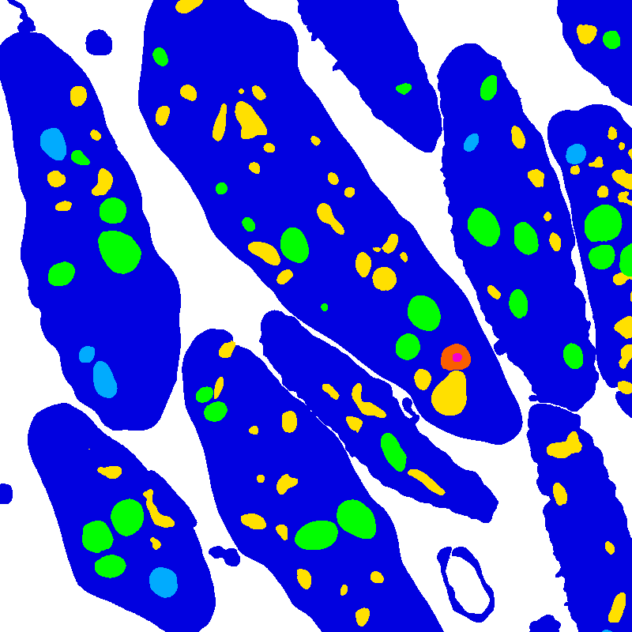

Segmentation datasets from 3D biological microscopy, organized by [LCIMB](about-lcimb/), a part of NIH/NIBIB.

---

# Platelet

## Download

All image and label files can be downloaded as one archive [here](https://www.dropbox.com/s/c0jg8biqq66w32r/platelet-lcimb.zip?dl=1) (98.4 MB)

Alternately, image and label files can be downloaded separately:

### Images

[Download images](https://put.real.link.here) (90.9 MB)

### Labels

[Download semantic labels](https://www.dropbox.com/s/p4iugak20g8uccd/labels-semantic.zip?dl=1) (2.1 MB)

[Download 2d instance labels](https://www.dropbox.com/s/janmagx6iibybtk/labels-instance-2d.zip?dl=1) (2.7 MB)

[Download 3d instance labels](https://www.dropbox.com/s/n3jry3nt4pyn7d7/labels-instance-3d.zip?dl=1) (2.6 MB)

---

## Description

Created by [LCIMB](about-lcimb/) in collaboration with the [Storrie lab](https://physiology.uams.edu/faculty/brian-storrie/). The **platelet** dataset contains two 3D images of human platelets, as well as instance and semantic segmentations of those two image volumes.

This data has been reviewed by NIBIB and cleared for public release, and contains no PII or PHI. All files use a multipage uint16 TIF format. A 3D image with size [Z, X, Y] is saved as Z pages of size [X, Y]. Image voxels are approximately 40x10x10 nm^3. 

### Images

The **platelet** image volumes were acquired by a [Gatan 3View](https://www.gatan.com/products/sem-imaging-spectroscopy/3view-system) serial block-face scanning electron microscope (SBF-SEM) by members of LCIMB. 

Image files are: 
- **50-images.tif**, a 50x800x800 SBF-SEM image saved as a grayscale TIF.
- **24-images.tif**, a 24x800x800 SBF-SEM image saved as a grayscale TIF.

### Labels

Label TIF files assign a color to each voxel in a corresponding image file. The colors correspond to labels, either object classes for semantic labels or unique object ids for instance labels.

#### Semantic labels

Semantic label files classify each image voxel into one of seven classes, indexed from 0-6:

| Index | Color | Class name |
| --- | --- |
| 0 | None | Background |
| 1 | Dark Blue | Cell |
| 2 | Cyan | Mitochondria |
| 3 | Green | Alpha granule |
| 4 | Yellow | Canalicular vessel |
| 5 | Red | Dense granule body |
| 6 | Purple | Dense granule core |

Semantic label files are:
- **50-semantic.tif**: a 50x800x800 semantic segmentation of _50-images.tif_, saved as an RGB TIF.
- **24-semantic.tif**: A 24x800x800 semantic segmentation of _24-images.tif_, saved as an RGB TIF.

#### 2D instance labels

Coming up!

#### 3D instance labels

Coming up!
