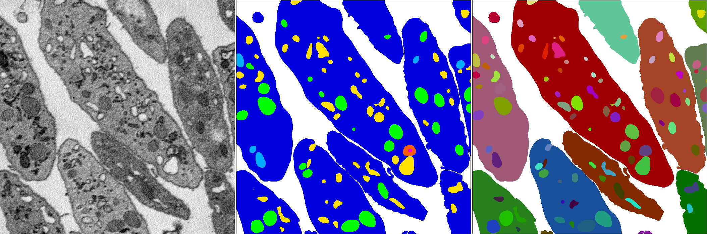
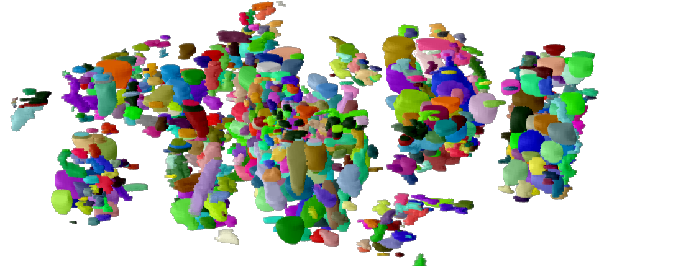

Segmentation datasets from 3D biological microscopy. Organized by [LCIMB](about-lcimb/), a part of [NIH/NIBIB](https://www.nibib.nih.gov/).

---

# platelet-em

<!-- 

 -->

### Download

[Download images and labels](https://www.dropbox.com/s/lo6i7v2mc9z2wft/images-and-labels.zip?dl=1) (95.8 MB)

### Description

[Click here](platelet-description.html) for a detailed description of the **platelet-em** dataset.