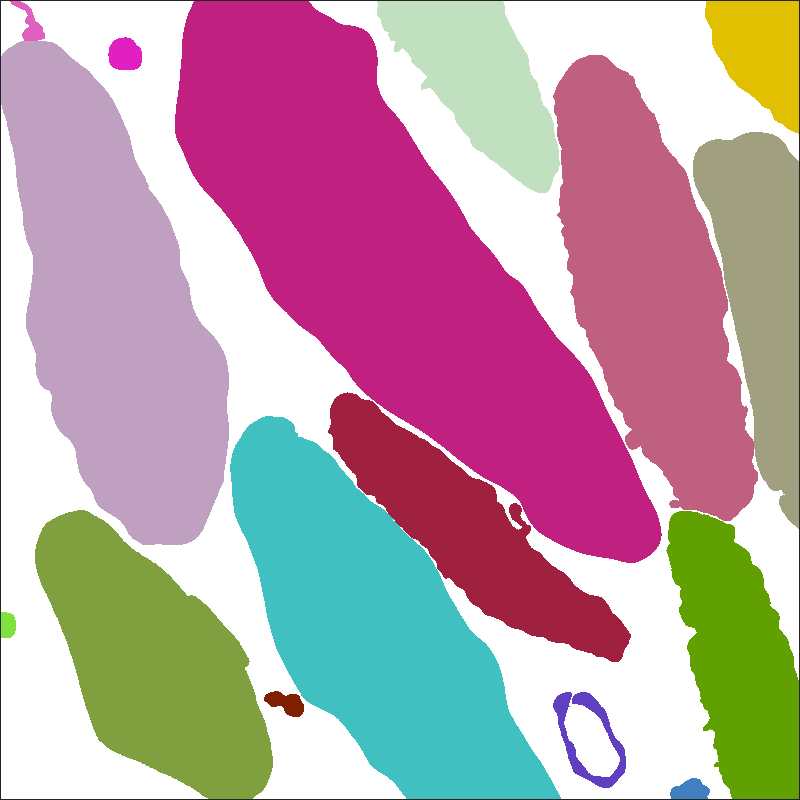

The **platelet-em** dataset contains two 3D scanning electron microscope (EM) images of human platelets, as well as instance and semantic segmentations of those two image volumes.

This data has been reviewed by NIBIB, contains no PII or PHI, and is cleared for public release. All files use a multipage uint16 TIF format. A 3D image with size [Z, X, Y] is saved as Z pages of size [X, Y]. Image voxels are approximately 40x10x10 nm<sup>3</sup>. 

## Download

Label files can be downloaded as RGBA TIF image volumes or as string-based JSON dictionaries. 

#### TIF

[Download images and TIF labels](https://www.dropbox.com/s/pvrfnurjq11k0l3/images_and_labels_rgba.zip?dl=1) (95.3 MB)

#### JSON

[Download images and JSON labels](https://www.dropbox.com/s/tgmwv9kegijfrao/images_and_labels_json.zip?dl=1) (98.2 MB)

---

## Image files


The **platelet** image volumes were acquired by a [Gatan 3View](https://www.gatan.com/products/sem-imaging-spectroscopy/3view-system) serial block-face scanning electron microscope (SBF-SEM). 

Image files are: 

- **50-images.tif**, a 50x800x800 SBF-SEM image saved as a grayscale TIF.

- **24-images.tif**, a 24x800x800 SBF-SEM image saved as a grayscale TIF.

---

## Label files

Label data can be stored in image-based or text-based formats. Image files are better for visualization and image manipulation with GUIs, while text files are better for use with scripting. For its labels, **platelet-em** dataset uses TIF-formatted image files and JSON-formatted text files.

---

### TIF format 

Label TIF files assign a color to each voxel in a corresponding image file. The colors correspond to labels, either object classes for semantic labels or unique object ids for instance labels.

---

#### Semantic labels


Semantic label files classify each image voxel into one of seven classes, indexed from 0-6:

| Index | Color | Class name |
| --- | --- |
| 0 | None | Background |
| 1 | Dark Blue | Cell |
| 2 | Cyan | Mitochondria |
| 3 | Green | Alpha granule |
| 4 | Yellow | Canalicular vessel |
| 5 | Red | Dense granule body |
| 6 | Purple | Dense granule core |

Semantic label files are:

- **50-semantic.tif**: A 50x800x800 semantic segmentation of _50-images.tif_, saved as an RGB TIF.

- **24-semantic.tif**: A 24x800x800 semantic segmentation of _24-images.tif_, saved as an RGB TIF.

---

#### Instance labels




Instance labels are separated into two label files per image: cell and organelle. _Cell_ instance labels assign a unique id to each cell in an image volume. _Organelle_ instance labels assign a unique id to each organelle in an image volume. 

IDs are assigned to distinct objects within the entire 3D image volume. Tags for cross-sections of the same 3D object are the same between different 2D image windows.

Instance label files are:

- **50-instance-cell.tif**: A 50x800x800 instance segmentation of cells in _50-images.tif_, saved as an RGB TIF.

- **50-instance-organelle.tif**: A 50x800x800 instance segmentation of organelles in _50-images.tif_, saved as an RGB TIF.

- **24-instance-cell.tif**: A 24x800x800 instance segmentation of cells in _24-images.tif_, saved as an RGB TIF.

- **24-instance-organelle.tif**: A 24x800x800 instance segmentation of organelles in _24-images.tif_, saved as an RGB TIF.

---

### JSON format


For both semantic and instance labels, label data can be represented with a dictionary structure. Dictionary keys are the unique non-zero integer labels in the label data. For each key, the corresponding value is the binary mask of the region associated to the key. This mask is stored as a [run-length encoded](https://www.kaggle.com/paulorzp/run-length-encode-and-decode) string. An additional `'.info'` key stores image shape and datatype information.

File names are the same as for the TIF format, with the `.json` file format instead of `.tif`. Functions for converting between TIF and JSON formats, as well as between python strings and numpy ndarrays, can be found in the [bio3d_vision](https://github.com/bio3d-vision/bio3d_vision) package.

---

#### Example

In python - a synthetic blob image with two nonzero values:


```python
blob1 = skimage.data.binary_blobs(length=10, seed=1, volume_fraction=0.2)
blob2 = skimage.data.binary_blobs(length=10, seed=2, volume_fraction=0.1)
image = np.zeros((10, 10), dtype=int)
image[blob1] = 1
image[blob2] = 2
```

has the following JSON-compatible dictionary representation:

```python
image_as_dict = {
    '.info': {'dtype': 'np.int', 'shape': (10, 10)},
    '1': '7 2 12 1 21 1 40 1 50 4 60 3 68 1 71 1 81 1',
    '2': '1 3 11 1 33 2 42 3 87 2'}
```
