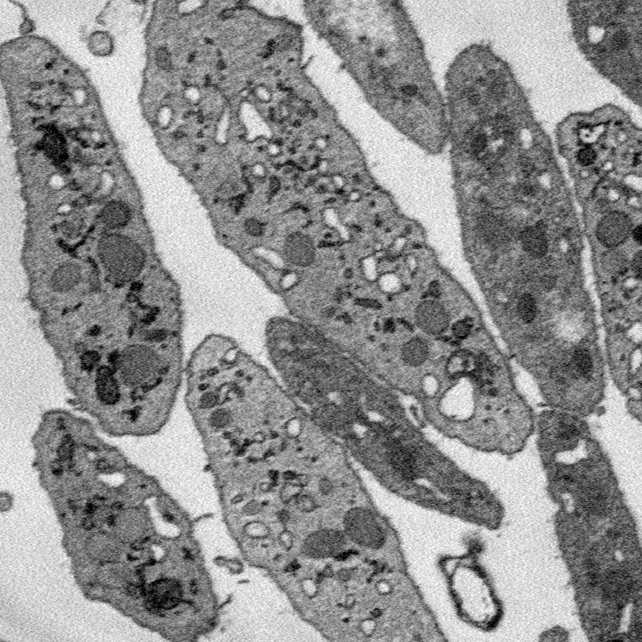
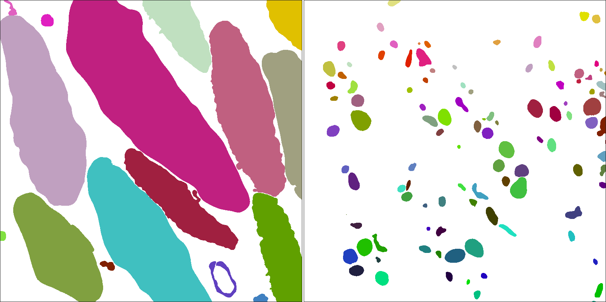

Created by [LCIMB](about-lcimb/) in collaboration with the [Storrie lab](https://physiology.uams.edu/faculty/brian-storrie/). The **platelet** dataset contains two 3D images of human platelets, as well as instance and semantic segmentations of those two image volumes.

This data has been reviewed by NIBIB and cleared for public release, and contains no PII or PHI. All files use a multipage uint16 TIF format. A 3D image with size [Z, X, Y] is saved as Z pages of size [X, Y]. Image voxels are approximately 40x10x10 nm3. 

## Image files

The **platelet** image volumes were acquired by a [Gatan 3View](https://www.gatan.com/products/sem-imaging-spectroscopy/3view-system) serial block-face scanning electron microscope (SBF-SEM) by members of LCIMB. 

Image files are: 

- **50-images.tif**, a 50x800x800 SBF-SEM image saved as a grayscale TIF.

- **24-images.tif**, a 24x800x800 SBF-SEM image saved as a grayscale TIF.

## Label files

Label TIF files assign a color to each voxel in a corresponding image file. The colors correspond to labels, either object classes for semantic labels or unique object ids for instance labels.

#### Semantic labels

Semantic label files classify each image voxel into one of seven classes, indexed from 0-6:

| Index | Color | Class name |
| --- | --- |
| 0 | None | Background |
| 1 | Dark Blue | Cell |
| 2 | Cyan | Mitochondria |
| 3 | Green | Alpha granule |
| 4 | Yellow | Canalicular vessel |
| 5 | Red | Dense granule body |
| 6 | Purple | Dense granule core |

Semantic label files are:

- **50-semantic.tif**: A 50x800x800 semantic segmentation of _50-images.tif_, saved as an RGB TIF.

- **24-semantic.tif**: A 24x800x800 semantic segmentation of _24-images.tif_, saved as an RGB TIF.

#### Instance labels

Instance labels come in four varieties: 2D and 3D, cell and organelle. _Cell_ instance labels assign a unique id to each cell in an image volume. _Organelle_ instance labels assign a unique id to each organelle in an image volume.

**2D instance labels**

IDs are assigned to distince object cross-sections within 2D image windows. Tags for cross-sections of the same 3D object are not linked between different 2D image windows.

**3D instance labels**

Tags are assigned to distince objects within the entire 3D image volume. Tags for cross-sections of the same 3D object are the same between different 2D image windows.

Instance label files are:

- **50-instance-cell-2d.tif**: A 50x800x800 2D instance segmentation of cells in _50-images.tif_, saved as an RGB TIF.

- **50-instance-organelle-2d.tif**: A 50x800x800 2D instance segmentation of organelles in _50-images.tif_, saved as an RGB TIF.

- **50-instance-cell-3d.tif**: A 50x800x800 3D instance segmentation of cells in _50-images.tif_, saved as an RGB TIF.

- **50-instance-organelle-3d.tif**: A 50x800x800 3D instance segmentation of organelles in _50-images.tif_, saved as an RGB TIF.

- **24-instance-cell-2d.tif**: A 24x800x800 2D instance segmentation of cells in _24-images.tif_, saved as an RGB TIF.

- **24-instance-organelle-2d.tif**: A 24x800x800 2D instance segmentation of organelles in _24-images.tif_, saved as an RGB TIF.

- **24-instance-cell-3d.tif**: A 24x800x800 3D instance segmentation of cells in _24-images.tif_, saved as an RGB TIF.

- **24-instance-organelle-3d.tif**: A 24x800x800 3D instance segmentation of organelles in _24-images.tif_, saved as an RGB TIF.